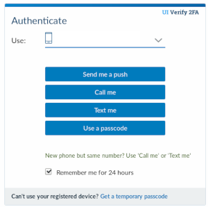

# IlliniKey



Generate one time passwords (OTP) offline for UIUC Duo login.  Based heavily on [local-boilerkey](https://github.com/elnardu/local-boilerkey).

# Setup and usage

```
pip install illinikey
illinikey
```

Follow instructions for adding a new device.

# i3 configuration

Add to your i3 config to auto to auto-fill the passcode field on the Duo login screen.


```
bindsym $mod+x exec sh -c "xdotool type $(illinikey)"
```

# Caveats

Key secrets are stored in `~/.cache/illinikey.json`.  An attacker with access to this file can bypass two-factor on your UIUC account.
